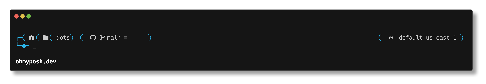

# bash

Configuración del shell: `.bashrc`, `.bash_aliases` y prompt con oh-my-posh.

## Archivos

| Archivo | Destino | Descripción |
|---|---|---|
| `.bashrc` | `~/.bashrc` | Exporta variables de entorno, carga aliases y prompt |
| `.bash_aliases` | `~/.bash_aliases` | Aliases para `cat`, `ls`, `yazi` y `calibre-sync` |
| `.posh_config.yaml` | `~/.posh_config.yaml` | Tema de oh-my-posh |

Los symlinks los crea `setup.sh` desde la raíz del repo.

## Vista previa



## Dependencias

| Software | Fedora | Ubuntu | Uso |
|---|---|---|---|
| `bat` | `bat` | `bat` (binario: `batcat`) | Alias de `cat` con syntax highlight |
| `eza` | `eza` | `eza` | Alias de `ls` con iconos |
| `oh-my-posh` | via curl | via curl | Prompt personalizado |
| `rclone` | `rclone` | `rclone` | Alias `calibre-sync` (sincroniza `~/Calibre` con Google Drive) |

```bash
# Fedora
sudo dnf install bat eza rclone

# Ubuntu
sudo apt install bat eza rclone

# oh-my-posh (ambos)
curl -s https://ohmyposh.dev/install.sh | bash -s -- -d ~/.local/bin
oh-my-posh font install meslo
```

> En Fedora el binario es `bat`; en Ubuntu es `batcat`. El `.bash_aliases` detecta cuál está disponible automáticamente.

## calibre-sync

Sincroniza en ambos sentidos `~/Calibre` con la carpeta `calibre` de Google Drive (`rclone bisync`). `install-deps.sh` instala `rclone`, pero en un equipo nuevo hay que configurarlo a mano una vez:

1. Crear el remote `Calibre` de tipo Google Drive (abre el navegador para iniciar sesión):

   ```bash
   rclone config create Calibre drive scope=drive
   ```

2. Inicializar bisync. Solo se hace la primera vez; une el contenido de ambos lados:

   ```bash
   rclone bisync Calibre:calibre ~/Calibre --resync
   ```

3. Desde ahí, basta con:

   ```bash
   calibre-sync
   ```

> `~/.config/rclone/rclone.conf` guarda el token de Google Drive: no lo subas a este repo.
